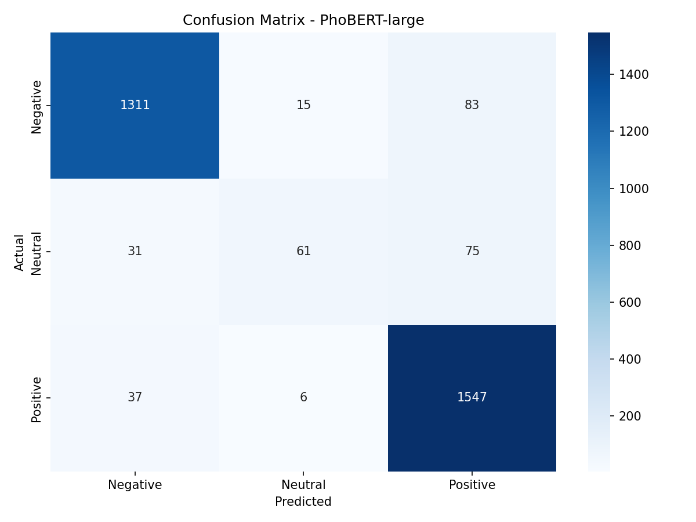

# Phân tích lỗi chi tiết - PhoBERT-large

**Tổng số mẫu test:** 3166

**Số mẫu đúng:** 2919

**Số mẫu sai:** 247

**Accuracy:** 92.20%

## Confusion Matrix

## Phân loại lỗi theo loại

| Loại lỗi | Số lượng | Tỷ lệ |

|----------|----------|-------|

| Negative → Positive | 83 | 33.6% |

| Neutral → Positive | 75 | 30.4% |

| Positive → Negative | 37 | 15.0% |

| Neutral → Negative | 31 | 12.6% |

| Negative → Neutral | 15 | 6.1% |

| Positive → Neutral | 6 | 2.4% |

## Ví dụ các câu bị phân loại sai

### Neutral → Positive

| Câu | Confidence | Phân tích |

|-----|------------|------------|

| cách mà cô tiếp cận với sinh viên . | 0.94 | - |

| môn học này giúp chúng em hiểu ra những vấn đề cơ bản . | 1.00 | - |

| ví dụ phù hợp với nội dung kiến thức , hướng dẫn chi tiết . | 1.00 | - |

| kỹ những chương cuối . | 1.00 | - |

| cô cho em 10 điểm thực hành yêu thích . | 1.00 | - |

### Neutral → Negative

| Câu | Confidence | Phân tích |

|-----|------------|------------|

| như vậy tụi em sẽ định hướng tốt hơn và tập trung vào những thứ cần thiết . | 1.00 | - |

| cách tính điểm cộng của giáo viên có điểm quá trình . | 1.00 | - |

| hơi nhanh nhưng em vẫn theo kịp được . | 0.99 | - |

| em nghĩ như vậy sẽ tốt hơn vì họ sẽ biết được khả năng của sinh viên trong lớp t... | 0.99 | - |

| tính thực tiễn của môn học . | 0.89 | - |

### Positive → Negative

| Câu | Confidence | Phân tích |

|-----|------------|------------|

| giảng bài thu hút , dí dỏm . | 0.99 | - |

| trong trường macbook thầy số hai thì không có máy nào số một . | 0.92 | - |

| phần lớn chỉ là lý thuyết và bài tập . | 0.99 | - |

| cần có nhiều giảng viên như cô dạy hơn . | 0.99 | - |

| cô hoàng toàn không dùng courses hay các phương tiện liên lạc thông báo . | 1.00 | - |

### Negative → Positive

| Câu | Confidence | Phân tích |

|-----|------------|------------|

| gây mê , hay mắng và rất dễ hờn coloncontemn . | 1.00 | - |

| hoặc cô có thể cung cấp trực tiếp slide tiếng anh để sinh viên học . | 0.51 | - |

| thầy dạy dễ hiểu tuy nhiên nhiều lúc hơi nhanh . | 1.00 | - |

| đề kiểm tra quá dễ . | 1.00 | - |

| cô cho tài liệu học tập là một trang web , lên đó tự học và làm đồ án . | 0.97 | - |

## Lỗi với độ tự tin cao (>0.9)

*Model rất tự tin nhưng sai - Cần phân tích kỹ*

**Số lượng:** 217

| Câu | Thật | Dự đoán | Confidence |

|-----|------|---------|------------|

| giảng bài thu hút , dí dỏm . | Positive | Negative | 0.99 |

| tính điểm thi đua các nhóm . | Positive | Neutral | 0.96 |

| trong trường macbook thầy số hai thì không có máy nào số một... | Positive | Negative | 0.92 |

| cách mà cô tiếp cận với sinh viên . | Neutral | Positive | 0.94 |

| môn học này giúp chúng em hiểu ra những vấn đề cơ bản . | Neutral | Positive | 1.00 |

| phần lớn chỉ là lý thuyết và bài tập . | Positive | Negative | 0.99 |

| như vậy tụi em sẽ định hướng tốt hơn và tập trung vào những ... | Neutral | Negative | 1.00 |

| ví dụ phù hợp với nội dung kiến thức , hướng dẫn chi tiết . | Neutral | Positive | 1.00 |

| cần có nhiều giảng viên như cô dạy hơn . | Positive | Negative | 0.99 |

| gây mê , hay mắng và rất dễ hờn coloncontemn . | Negative | Positive | 1.00 |

## Phân tích lớp Neutral

**Tổng Neutral trong test:** 167

**Neutral bị nhầm:** 106

### Các câu Neutral bị nhầm

| Câu | Bị nhầm thành | Confidence |

|-----|---------------|------------|

| cách mà cô tiếp cận với sinh viên . | Positive | 0.94 |

| môn học này giúp chúng em hiểu ra những vấn đề cơ bản . | Positive | 1.00 |

| như vậy tụi em sẽ định hướng tốt hơn và tập trung vào những thứ cần th... | Negative | 1.00 |

| ví dụ phù hợp với nội dung kiến thức , hướng dẫn chi tiết . | Positive | 1.00 |

| kỹ những chương cuối . | Positive | 1.00 |

| cô cho em 10 điểm thực hành yêu thích . | Positive | 1.00 |

| đã có làm đơn với phòng đào tạo . | Positive | 0.65 |

| có kết hợp với bài tập ví dụ . | Positive | 1.00 |

| bài tập đầy đủ . | Positive | 1.00 |

| có cung cấp tài liệu cho sinh viên . | Positive | 1.00 |
